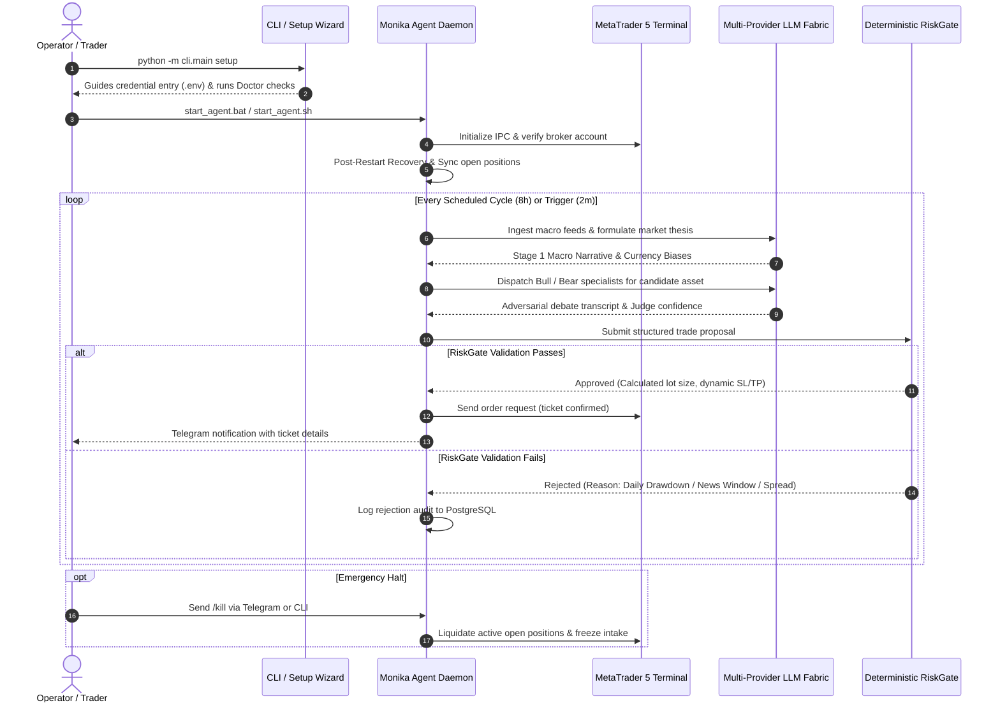

# Project Requirements Document (PRD): Monika

**Document Version:** 1.1.0  
**Project Status:** Early-Stage Research & Active Development  
**Primary System Role:** Domain-Specific Trading Agent Harness & Multi-Agent Execution Framework for MetaTrader 5 (MT5)  
**Execution Runtime:** MetaTrader 5 (Windows Native IPC & Linux Wine/Docker RPC)  
**Database Backend:** PostgreSQL 16+ (Asyncpg + SQLAlchemy 2.0 + Alembic)  
**Cognitive Framework:** LangGraph StateGraph, Multi-Provider LLM Routing, Dialectical Debate Engine  
**Author & Maintainer:** Saiful Akbar & Contributors  

---

## 1. Executive Summary & Vision

### 1.1 What is Monika?
**Monika** is an open-source, domain-specific **Trading Agent Harness** and multi-agent execution framework designed for quantitative financial research and automated trade supervision on **MetaTrader 5 (MT5)**.

Rather than relying on a single large language model (LLM) or a collection of static technical indicators, Monika establishes a structured pipeline:
1. **Macroeconomic and news ingestion** to determine multi-day global market context.
2. **Deterministic microstructure calculations** (Smart Money Concepts / SMC, Fair Value Gaps, Liquidity Sweeps, and Time-Series forecasting models).
3. **Dialectical multi-agent adversarial debate** where specialized Bullish and Bearish personas cross-examine trading hypotheses.
4. **An unbypassable, mechanical capital protection fortress** (`RiskGate`) that deterministically validates, resizes, or rejects proposals before any broker order can be formed.
5. **A resilient execution layer** combining direct MetaTrader 5 Python IPC with an independent MQL5 Expert Advisor (`AIAgent_EA.mq5`) acting as a broker-side dead-man's switch.

### 1.2 The Core Concept: Why an "Agent Harness"?
In modern artificial intelligence engineering, an **Agent Harness** is the specialized runtime substrate that equips, constrains, isolates, and monitors an autonomous agent. 

Large language models are inherently probabilistic, non-deterministic, and prone to hallucinations. In financial markets, giving an unconstrained LLM direct access to broker order placement is hazardous. Monika provides the harness:
- **Perception Harness:** Pre-fetches, cleans, and structures market quotes, economic calendars, and news feeds before the LLM ever sees them.
- **Cognitive Harness:** Orchestrates multi-agent discourse through a deterministic state machine (LangGraph), enforcing distinct roles (Macro Analyst, Technical Specialist, Bull Debater, Bear Debater, Investment Judge).
- **Safety Fortress Harness:** Enforces immutable mathematical boundaries (hard daily drawdown ceilings, volatility-adjusted position sizing, news event blackout windows, and circuit breakers). The AI can only *propose* a trade hypothesis; only the mechanical backend can *dispose* and execute it.
- **Lifecycle & Plugin Harness:** Coordinates background tasks, dynamic plugins, event bus subscriptions, and graceful restarts.
- **Evaluation Harness:** Provides offline point-in-time backtesting, hostile market scenario probes, and model benchmarking (Alpha Arena) to evaluate reasoning against market realities.

### 1.3 Project Maturity: An Honest Assessment
Monika is an **early-stage, experimental research project**. It is not a turnkey financial product or a get-rich-quick algorithmic trading solution. 

While the system contains extensive architectural foundations, sophisticated pipelines, and defensive mechanisms, it remains under active development. Users and developers should expect rough edges, ongoing architectural refinements, occasional edge-case bugs, and continuous updates.

The codebase is shared openly in the spirit of collaborative systems engineering. The maintainer warmly welcomes constructive feedback, technical critique, bug reports, and contributions from algorithmic traders, software engineers, and quantitative finance researchers.

---

## 2. Problem Statement & Motivation

### 2.1 The Limitations of Traditional Automated Trading Systems
- **Rigidity of Hardcoded Bots:** Traditional Expert Advisors (EAs) and rule-based bots rely on static parameters (e.g., RSI overbought/oversold, moving average crossovers). They struggle to interpret sudden macroeconomic shifts, geopolitical announcements, or unexpected central bank rate decisions.
- **Lack of Narrative Context:** Static bots cannot distinguish between normal price consolidation and pre-event liquidity accumulation before high-impact economic releases (e.g., US Non-Farm Payrolls, FOMC statements).

### 2.2 The Risks of Naive Generative AI Trading
- **Hallucinated Coordinates:** When asked for trade setups, generative LLMs frequently generate mathematically invalid numbers (e.g., a stop loss placed on the wrong side of an entry price, or unreasonable risk/reward ratios).
- **Inability to Perform Precise Math:** LLMs struggle with reliable float-point calculations for lot sizing, ATR calculations, and equity percentage allocations.
- **Emotional and Sycophantic Drift:** Single-prompt agents often suffer from confirmation bias, immediately agreeing with the user's directional bias or becoming overconfident following short-term winning streaks.

### 2.3 The Monika Approach
Monika bridges this divide by assigning each domain to its proper tool:
- **LLMs handle what they do best:** Synthesizing unstructured textual news, contextualizing monetary policy speeches, formulating qualitative trade arguments, and stress-testing opposing perspectives through adversarial debate.
- **Deterministic Python handles what it does best:** High-speed floating-point mathematics, technical indicator computation, market structure identification, portfolio correlation tracking, strict position sizing, and immutable capital limits.

---

## 3. Core Architectural Principles

Monika is engineered around five non-negotiable principles:

```
┌─────────────────────────────────────────────────────────────────────────────┐
│                          MONIKA CORE PHILOSOPHY                             │
├─────────────────────────────────────────────────────────────────────────────┤
│  1. "AI Proposes, Mechanical Fortress Disposes" (Fail-Closed Architecture)  │
│  2. Strict Separation of Concerns (Cognitive Reasoning vs. Exact Math)      │
│  3. Capital Preservation as the Primary Directive (Survival > Profit)       │
│  4. Comprehensive Auditability & Persistent Memory (Every Token & Ticket)   │
│  5. Humble Engineering & Graceful Degradation (Fail-Safe Defaults)          │
└─────────────────────────────────────────────────────────────────────────────┘
```

1. **"AI Proposes, Mechanical Fortress Disposes"**: AI agents produce structured proposals (`SubmitAssetAnalysisSchema`), never direct broker orders. Every proposal must pass through a strict mathematical filter (`RiskGate`) before reaching the broker execution bridge.
2. **Separation of Concerns**: Indicators (ATR, RSI, Moving Averages), structural zones (Fair Value Gaps, Swing Pivots), and position lot sizes are computed strictly by deterministic Python modules. The LLM is never permitted to calculate lot sizes or pip measurements mentally.
3. **Capital Preservation Above All**: Protecting trading capital takes precedence over generating alpha. If market conditions are ambiguous, volatile, or anomalous, the correct and praised action is `WAIT` or `NO TRADE`.
4. **Comprehensive Auditability**: Every prompt payload, tool execution, token expenditure, debate argument, judicial verdict, and broker order ticket is permanently logged into PostgreSQL.
5. **Humble Engineering & Graceful Degradation**: In the event of API provider rate limits, network timeouts, or broker disconnections, the system immediately fails safe into an idle or defensive posture rather than attempting speculative recovery.

---

## 4. Target Audience & User Personas

| Persona | Primary Goal | How Monika Serves Them |
| :--- | :--- | :--- |
| **Quantitative Developer** | Build and test algorithmic strategies combining technicals and macro data. | Provides an extensible Python harness with native MT5 IPC, modular indicator engines, and event bus architectures. |
| **Systematic Trader** | Automate trade execution while keeping strict control over drawdown and risk. | Offers a fail-closed `RiskGate`, daily drawdown circuit breakers, and an MQL5 dead-man switch. |
| **AI / NLP Researcher** | Study multi-agent adversarial debate and calibration in decision systems. | Features a LangGraph state machine with Bull/Bear debaters, judicial scoring, and prompt caching economics. |
| **Self-Hosted Operator** | Run a reliable 24/7 personal trading assistant on a VPS or home server. | Provides a full-stack Web Dashboard, Terminal UI (TUI), and a Telegram supervision bot. |

---

## 5. End-to-End System Architecture

Monika's architecture is organized into three primary operational tiers:

```mermaid
flowchart TD
    subgraph CognitiveTier ["1. Perception & Cognitive Reasoning Tier"]
        DataSources[Market Data, News RSS, Calendars, FRED API] --> Stage1[Stage 1: Macroeconomic Grounding]
        DataSources --> SMC[Deterministic Microstructure Engine<br/>FVG / BOS / CHoCH / Sweeps]
        Stage1 --> Stage2[Stage 2: Tactical Asset Synthesis]
        SMC --> Stage2
        Stage2 --> Bull[Bull Specialist Agent]
        Stage2 --> Bear[Bear Specialist Agent]
        Bull <--> Debate[Dialectical Adversarial Debate]
        Bear <--> Debate
        Debate --> Judge[Investment Arbitration Judge]
        Judge --> Proposal[Structured Trade Proposal]
    end

    subgraph FortressTier ["2. Deterministic Safety Fortress Tier"]
        Proposal --> RiskGate{Deterministic RiskGate}
        QuantRunner[Edge Strategy Runner<br/>Deterministic Quant Alpha] --> SignalArb[Signal Arbitrator]
        RiskGate -- Breached --> Reject[Proposal Rejected & Logged]
        RiskGate -- Approved --> Sizer[Volatility & Kelly Position Sizer]
        SignalArb --> Sizer
    end

    subgraph ExecutionTier ["3. Broker Execution & Observability Tier"]
        Sizer --> ExecService[Execution Service]
        ExecService --> MT5_IPC[Native MetaTrader 5 Python IPC]
        ExecService --> EA_Bridge[MQL5 Expert Advisor<br/>Heartbeat Dead-Man Switch]
        MT5_IPC --> Broker[(Broker Order Book)]
        EA_Bridge --> Broker
        
        Broker --> Postgres[(PostgreSQL 16+ Database)]
        Postgres --> Dashboard[React 19 Web Dashboard]
        Postgres --> TUI[Terminal UI (TUI)]
        Postgres --> TeleBot[Telegram Bot & Omnichannel Gateway]
    end
```

---

## 6. Functional Requirements (FR)

### FR-1: Macroeconomic Grounding & News Ingestion
- **FR-1.1 (Economic Calendar Monitoring):** The system shall poll macroeconomic calendars (via programmatic APIs and structured feeds) to track upcoming releases (CPI, PPI, NFP, Unemployment, GDP, FOMC).
- **FR-1.2 (Active Calendar Poller):** Preceding high-impact releases, the system shall increase polling frequency to capture actual reported figures within seconds of release.
- **FR-1.3 (Post-Release Impact Analysis):** The system shall maintain an enforced 15-minute post-news settlement window to prevent trading during wide broker spread spikes and erratic slippage. Once settled, the system calculates the *economic surprise* (`actual` vs `forecast`) to update asset biases.
- **FR-1.4 (Thematic News Summarization):** The system shall cluster raw headlines into thematic currency digests, cross-referencing news claims against official calendar data to reduce token overhead.

### FR-2: Microstructure & Technical Analysis
- **FR-2.1 (Classical Indicators):** The system shall compute moving averages (EMA 20, SMA 50, SMA 200), RSI (14), ATR (14), and Average Daily Range (ADR) deterministically from verified OHLCV bars.
- **FR-2.2 (Smart Money Concepts / SMC):** The system shall identify structural market milestones:
  - Swing Highs and Swing Lows (Fractal pivots).
  - Break of Structure (BOS) and Change of Character (CHoCH).
  - Fair Value Gaps (FVG) categorized as unfilled, partially filled, or mitigated.
  - Liquidity Pools (buy-side and sell-side liquidity clusters).
- **FR-2.3 (Deep Learning Forecasting):** The system supports an optional integration with **Google TimesFM 3.0** to generate forward-looking quantile volatility bounds ($q_{0.1}$ to $q_{0.9}$) for intraday range guidance.

### FR-3: Multi-Agent Adversarial Debate & Arbitration
- **FR-3.1 (Hierarchical Decision Graph):** Decision making shall be governed by a stateful LangGraph workflow containing explicit nodes for prefetching, fundamental analysis, asset screening, specialist debate, risk gating, and execution.
- **FR-3.2 (Adversarial Bull and Bear Agents):** For candidate setups passing prescreening, dedicated Bullish and Bearish personas shall debate the thesis across multiple rounds, identifying structural invalidations, unmitigated order blocks, and adverse market factors.
- **FR-3.3 (Judicial Arbitration & Confidence Scoring):** An impartial `InvestmentJudge` persona shall evaluate debate arguments against empirical chart data, producing a calibrated confidence score between `0.0` and `1.0`. Setups falling below the configured threshold (e.g., `0.70`) shall be discarded.
- **FR-3.4 (Deterministic Coordinate Snapping):** If an LLM proposal suggests price coordinates that slightly drift from confirmed structural levels, the backend `OutputVerifier` shall automatically snap them to verified swing pivots or FVG boundaries.

### FR-4: Deterministic Capital Protection (RiskGate)
- **FR-4.1 (Mandatory Risk Clearance):** No trade proposal shall reach the broker without passing all 10 deterministic checks in `RiskGate`:
  1. System pause / operational status check.
  2. Sizing and positive lot volume verification.
  3. Daily realized and unrealized drawdown ceilings (default maximum 3.0%).
  4. Maximum concurrent open positions ceiling (default maximum 5).
  5. Duplicate asset and direction exposure check.
  6. High-impact news event proximity filter (blocks entries within $\pm 15$ minutes of tier-1 events).
  7. Cross-asset portfolio correlation cap (prevents concentrated directional bets across correlated pairs).
  8. Maximum spread threshold filter (prevents execution during broker spread expansion).
  9. Minimum Risk-to-Reward ratio verification (default minimum $1:1.3$ or $1:2.0$).
  10. Weekend gap risk quarantine (halts new trades late Friday UTC).
- **FR-4.2 (Circuit Breakers):** If daily floating or realized drawdown exceeds the safety threshold, the system shall trigger an emergency circuit breaker, freezing new order generation and optionally liquidating active exposure.
- **FR-4.3 (Flash Crash Detection):** If sudden, extreme price dislocation is detected (e.g., price travel exceeding $5\times$ ATR within 30 seconds), the system shall immediately trail existing stops to breakeven and place the affected asset in temporary quarantine.

### FR-5: MetaTrader 5 Broker Connectivity & Execution
- **FR-5.1 (Native Python IPC):** On Windows hosts, the system shall communicate directly with the local MetaTrader 5 Desktop Terminal via the official `MetaTrader5` package.
- **FR-5.2 (MQL5 EA Dead-Man's Switch):** An Expert Advisor (`AIAgent_EA.mq5`) running inside MT5 shall monitor an external `heartbeat.txt` file written by the Python agent. If the Python process hangs, crashes, or terminates without updating the timestamp within 120 seconds, the EA automatically protects open capital.
- **FR-5.3 (Paper Trading Graduation Requirement):** The platform defaults strictly to paper-trading mode (`paper_trading.enabled: true`). Switching to live money execution requires accumulating at least 50 validated paper trades with an overall win rate $\ge 55\%$.
- **FR-5.4 (Order Reconciliation):** The system shall periodically reconcile database records against live broker positions to resolve discrepancies caused by broker-side stop-outs or manual interventions.

### FR-6: Agent Harness & Extensible Plugin Subsystem
- **FR-6.1 (Universal Plugin Contract):** The harness defines standardized interfaces (`TradingPlugin`, `PluginContext`, `PluginMetadata`) across distinct categories: analysis pipelines, brokers, schedulers, risk rules, dynamic sizing, tools, and indicators.
- **FR-6.2 (Topological Dependency Resolution):** The harness engine discovers and initializes plugins using Kahn's topological sort, guaranteeing proper lifecycle ordering and clean teardown via disposer stacks.
- **FR-6.3 (Event Bus Subscriptions):** Provides an in-process, typed pub/sub bus (`EventBus`) for decoupled reactions to market ticks, bar completions, order state shifts, and risk breaches.

### FR-7: Omnichannel Gateway & Remote Supervision
- **FR-7.1 (Telegram Supervision Bot):** An interactive Telegram bot shall support remote operator commands (`/status`, `/positions`, `/brief`, `/risk`, `/vix`, `/pause`, `/resume`, `/kill`, `/help`).
- **FR-7.2 (Omnichannel Extensibility):** The gateway architecture supports adapters for Discord, Slack, Webhook ingress, and the Agent Client Protocol (ACP) with rate limiting and turn-lease concurrency locks.

### FR-8: Memory & Continuous Learning Subsystem
- **FR-8.1 (Layered Memory Architecture):**
  - *Layer 0 (Soul):* Immutable core trading philosophy and risk identity.
  - *Layer 1 (Macro Reality):* Verified geopolitical, central bank, and macroeconomic baseline.
  - *Layer 2 (Chronicle):* Ongoing chronicle of market regimes, shifts, and weekly narratives.
  - *Layer 3 (Episodic Reflection):* Post-trade reflections evaluating whether executed setups unfolded as expected, extracting empirical lessons into persistent storage.

### FR-9: Offline Research, Backtesting & Model Evaluation
- **FR-9.1 (Point-in-Time Backtesting):** Offline simulation engine reproducing historical candles and economic releases without future lookahead bias.
- **FR-9.2 (Alpha Arena Model Benchmarking):** Automated comparative arena pitting different LLM providers against historical market fixtures to measure reasoning quality, token drift, and pricing efficiency.
- **FR-9.3 (Hostile Market Probes):** Synthetic stress-testing suite injecting artificial flash crashes, spread spikes, and data dropouts to verify system resilience.

### FR-10: Observability & User Interfaces
- **FR-10.1 (Web Dashboard):** A full-featured web dashboard (React 19, TypeScript, Vite, Tailwind CSS) providing real-time telemetry, portfolio equity curves, open positions, risk gauges, and multi-agent DAG visualization.
- **FR-10.2 (Terminal UI - TUI):** A lightweight terminal interface built with Textual for server and SSH monitoring.
- **FR-10.3 (Interactive CLI Suite):** Comprehensive command-line interface supporting daemon management, interactive chat REPL, system doctor inspection, and setup wizards.

---

## 7. Non-Functional Requirements (NFR)

### NFR-1: Reliability & Fault Tolerance
- **NFR-1.1 (Fail-Closed Default):** Any unhandled exception, missing data feed, or ambiguity must cause trade evaluation to abort to a `NO TRADE` state.
- **NFR-1.2 (Process Supervision):** The platform startup scripts (`start_agent.bat` and `start_agent.sh`) shall wrap the daemon in an auto-restart loop with backoff delays, recording shutdown reasons.
- **NFR-1.3 (Single-Instance Locking):** Process execution shall be protected by file-based PID locks (`trading_agent.pid`) to prevent multiple instances from contending for the same broker account.

### NFR-2: Security & Credential Hygiene
- **NFR-2.1 (Credential Isolation):** Broker passwords, private API keys, and database connection strings must reside strictly in `.env` and must never be committed to source control or logged in plain text.
- **NFR-2.2 (Environment Variable Security Fence):** At boot, host-level bootstrap variables (`PATH`, `PYTHONPATH`, `SYSTEMROOT`) are snapshotted to prevent arbitrary override or tampering.
- **NFR-2.3 (SSRF & Sandbox Protection):** Web scrapers and programmatic tool executors are restricted from accessing local or private network ranges (`127.0.0.1`, `10.0.0.0/8`, `192.168.0.0/16`).

### NFR-3: Concurrency & Transactional Integrity
- **NFR-3.1 (PostgreSQL Advisory Locks):** Critical order placement and position modification sequences must obtain transactional advisory locks to preclude race conditions across concurrent tasks.
- **NFR-3.2 (Partial Unique Indexes):** Active orders and positions in PostgreSQL are backed by partial unique indexes ensuring no duplicate active orders can exist for the same asset signal.

### NFR-4: Token Economics & Operational Cost Efficiency
- **NFR-4.1 (Prompt Caching Optimization):** System prompts and recurring static instructions must be structured to exploit provider KV prompt caching, targeting cache hit rates $>70\%$.
- **NFR-4.2 (Task-Specific Model Routing):** Tasks are matched with models suited to their complexity (e.g., lighter models for news screening, high-reasoning models for debate arbitration).

### NFR-5: Portability & Environmental Compatibility
- **NFR-5.1 (Primary Windows Environment):** Native MT5 terminal execution requires Windows 10/11 or Windows Server.
- **NFR-5.2 (Linux VPS Compatibility):** Linux deployments are supported via Wine and containerized RPC bridges (`deploy/Dockerfile.mt5-wine`).

---

## 8. Data Schema & Persistence Model

The persistence layer is managed with **PostgreSQL 16+** using async SQLAlchemy 2.0 and Alembic migrations.

### Key Database Entities
```
┌─────────────────────────────────────────────────────────────────────────────┐
│                           CORE POSTGRESQL TABLES                            │
├───────────────────────┬─────────────────────────────────────────────────────┤
│ positions             │ Active and historical broker execution tickets.     │
│ trade_signals         │ Evaluated trading signals and arbitration outcomes. │
│ paper_trade_records   │ Simulated trade executions and graduation metrics.  │
│ risk_state            │ Daily drawdown meters, circuit breaker status.      │
│ fundamental_briefs    │ Stored Stage 1 macroeconomic regime evaluations.    │
│ debate_transcripts    │ Multi-round Bull/Bear debate arguments and verdicts.│
│ news_articles         │ Scraped news articles, source URLs, and timestamps. │
│ economic_events       │ Calendar releases, forecasts, and reported values.  │
│ decision_reflections  │ Post-trade reflections and empirical lessons.       │
│ token_usage_logs      │ Granular token tracking per model and task role.    │
│ activity_logs         │ Structured operational logs and diagnostic events.  │
└───────────────────────┴─────────────────────────────────────────────────────┘
```

---

## 9. User Journeys & Operational Workflows



---

## 10. Known Limitations & Technical Constraints

In keeping with our commitment to honest and grounded engineering, the following limitations are explicitly documented:

1. **MetaTrader 5 Dependency:** The core execution bridge requires MetaTrader 5. Platforms like cTrader, Interactive Brokers, or pure FIX protocol brokers require dedicated adapter plugins.
2. **Windows Operating System Reliance:** The official `MetaTrader5` Python library is compiled as a Windows C-extension. Running Monika on Linux requires Wine or network RPC containers, adding deployment complexity.
3. **External LLM Provider Latency & Costs:** Multi-agent adversarial debate requires several sequential API calls. Complete decision cycles may take 15 to 45 seconds, making this architecture unsuitable for sub-second High-Frequency Trading (HFT). Active analysis also incurs recurring API usage costs.
4. **Market Regime Shifts:** While historical Smart Money Concepts and macroeconomic principles provide structured context, financial markets are subject to unpredictable structural regime changes, black swan events, and sudden liquidity dry-ups. No software architecture can guarantee profitable outcomes.
5. **Early-Stage Codebase:** Features, submodules, and interfaces are actively evolving. While code quality is safeguarded by automated tests, unexpected behaviors and edge cases may still occur.

---

## 11. Project Roadmap & Future Enhancements

- [x] Multi-agent adversarial debate engine with LangGraph.
- [x] Deterministic 10-layer `RiskGate` and circuit breakers.
- [x] Dual MT5 bridge with MQL5 dead-man switch.
- [x] Web Dashboard (React 19) and Terminal UI (TUI).
- [x] Universal plugin harness and event bus architecture.
- [ ] Automated paper-trading graduation lifecycle reporting.
- [ ] Native FIX protocol and alternative broker adapters (cTrader / Interactive Brokers).
- [ ] Enhanced local offline LLM quantization profiles for reduced operational costs.
- [ ] Community-contributed strategy and indicator plugin catalog.

---

## 12. Community, Feedback & Open Collaboration

Monika is maintained as an open-source research initiative. We firmly believe that robust, safe trading architectures are built through open peer review, rigorous testing, and diverse perspectives.

We actively invite:
- **Bug reports and edge-case discoveries:** If you spot an issue in risk calculation, data parsing, or lifecycle management, please open a GitHub Issue.
- **Architectural discussions & advice:** Have ideas for improving agent orchestration, prompt caching, or execution latency? Start a Discussion!
- **Code contributions:** Pull requests for bug fixes, test coverage, documentation improvements, and new plugin adapters are warmly welcomed.

Please review our [Contributing Guidelines](CONTRIBUTING.md) and [Code of Conduct](CODE_OF_CONDUCT.md) before submitting pull requests.

---

## 13. Financial & Research Disclaimer

> [!CAUTION]
> **STRICTLY FOR RESEARCH, EDUCATIONAL, AND EXPERIMENTAL PURPOSES ONLY.**
>
> Financial speculation and trading in foreign exchange, commodities, cryptocurrencies, and leveraged instruments carry a substantial risk of financial loss. 
> 
> The authors, maintainers, and contributors of Monika make no claims, promises, warranties, or representations regarding financial profitability, operational reliability, or system fitness for real-money trading. 
> 
> Never risk capital you cannot comfortably afford to lose. Always validate algorithmic software extensively under paper-trading or demo-account conditions before considering live capital deployment.
