# Monika — Multi-Agent Trading Research Framework for MetaTrader 5

<p align="center">
  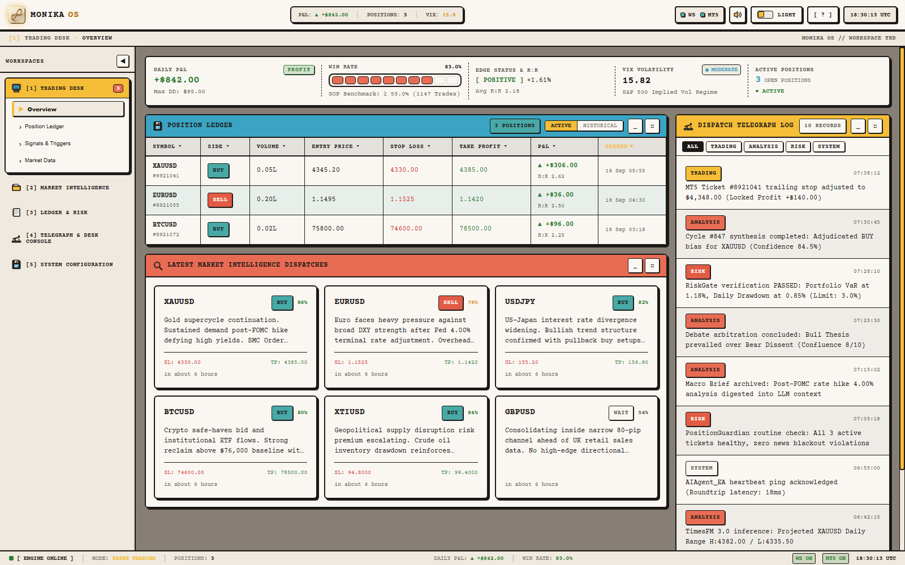
</p>

<p align="center">
  <strong>An open-source research framework exploring LLM-assisted market analysis with deterministic, code-enforced risk management in MetaTrader 5.</strong><br />
  <em>Integrates macroeconomic news ingestion, market structure indicators, bull/bear debate prompts, and hard mathematical risk gates.</em>
</p>

<p align="center">
  <a href="https://github.com/alakbarr/Monika/actions/workflows/ci.yml"></a>
  <a href="https://www.python.org/"></a>
  <a href="https://langchain-ai.github.io/langgraph/"></a>
  <a href="https://fastapi.tiangolo.com"></a>
  <a href="https://react.dev/"></a>
  <a href="https://www.postgresql.org"></a>
  <a href="https://www.metatrader5.com"></a>
  <a href="LICENSE"></a>
  <a href="https://github.com/astral-sh/ruff"></a>
</p>

---

## Project Status and Reality Check

> [!WARNING]
> **This is an experimental personal research project, not a turnkey commercial trading system, and not an automated profit generator.**
>
> - **Trading risks:** Financial trading involves substantial risk of loss. Adding language models to an algorithmic pipeline does not eliminate market risk.
> - **Model limitations:** Large language models are probabilistic. They make calculation errors, hallucinate price levels, and suffer from confirmation bias. They must never have direct, unconstrained access to broker order execution.
> - **Active development:** This codebase is an ongoing engineering exploration. Expect breaking changes, architectural refactoring, and edge-case bugs.
> - **Demo accounts only:** Always run this framework on paper-trading or demo accounts. Never deploy live capital without thoroughly auditing the code and risk models.

The goal of this project is to explore a strict separation of concerns: **the language model acts solely as a qualitative research assistant to draft hypotheses, while deterministic Python code performs all mathematics, indicator computations, lot sizing, and risk validation.**

---

## Table of Contents

- [1. Overview](#1-overview)
  - [Comparison of Approaches](#comparison-of-approaches)
  - [The Core Architecture: AI Proposes, Code Disposes](#the-core-architecture-ai-proposes-code-disposes)
  - [Design Principles](#design-principles)
- [2. Intended Audience](#2-intended-audience)
- [3. Core System Components](#3-core-system-components)
  - [Macroeconomic and News Ingestion](#macroeconomic-and-news-ingestion)
  - [Market Structure and Technical Indicators](#market-structure-and-technical-indicators)
  - [Bull vs. Bear Adversarial Debate](#bull-vs-bear-adversarial-debate)
  - [Pre-Trade Risk Controls (RiskGate)](#pre-trade-risk-controls-riskgate)
  - [Rule-Based Strategies and Signal Arbitration](#rule-based-strategies-and-signal-arbitration)
  - [MetaTrader 5 Interface and Watchdog EA](#metatrader-5-interface-and-watchdog-ea)
  - [Persistence and Post-Trade Review](#persistence-and-post-trade-review)
- [4. User Interfaces & Observability](#4-user-interfaces--observability)
  - [Web Dashboard (React 19 + Vite)](#web-dashboard-react-19--vite)
  - [Terminal User Interface (TUI)](#terminal-user-interface-tui)
- [5. System Architecture & Workflows](#5-system-architecture--workflows)
  - [End-to-End Pipeline](#end-to-end-pipeline)
  - [Background Task Schedulers](#background-task-schedulers)
- [6. Supported Assets & Model Configuration](#6-supported-assets--model-configuration)
  - [Supported Instruments](#supported-instruments)
  - [Model Routing Configuration](#model-routing-configuration)
- [7. Installation & Quickstart](#7-installation--quickstart)
  - [Prerequisites](#prerequisites)
  - [Step-by-Step Setup](#step-by-step-setup)
  - [Database Initialization](#database-initialization)
  - [Environment Variables (.env)](#environment-variables-env)
  - [Pre-Flight Diagnostic Check](#pre-flight-diagnostic-check)
  - [Starting the Application](#starting-the-application)
- [8. CLI & Telegram Reference](#8-cli--telegram-reference)
  - [Command-Line Interface](#command-line-interface)
  - [Telegram Bot Commands](#telegram-bot-commands)
- [9. Testing & Backtesting](#9-testing--backtesting)
  - [Running the Test Suite](#running-the-test-suite)
  - [Offline Backtesting](#offline-backtesting)
  - [Model Benchmarks](#model-benchmarks)
- [10. Frequently Asked Questions](#10-frequently-asked-questions)
- [11. Repository Structure](#11-repository-structure)
- [12. Contributing](#12-contributing)
- [13. Disclaimer](#13-disclaimer)

---

## 1. Overview

Monika is an experimental harness built to test whether generative language models can assist with market intelligence and pattern analysis without risking unconstrained execution errors.

### Comparison of Approaches

| Dimension | Traditional Expert Advisors | Direct LLM Trading Bots | Monika Approach |
| :--- | :--- | :--- | :--- |
| **Macro & News Context** | Blind to calendar events and policy speeches | Able to read text, but lacks reliable market grounding | Synthesizes macro feeds and calendars into structured briefs |
| **Math & Sizing** | Exact floating-point calculations | Frequent hallucinations and arithmetic errors | Plain Python computes all ATR sizing, lot bounds, and pips |
| **Analytical Bias** | Rigid static thresholds during market shifts | High confirmation bias; agrees with prompts | Adversarial Bull/Bear debate challenges trade ideas |
| **Execution Authority** | Direct order placement | Direct API calls with no safety boundaries | Strict deterministic code filters (RiskGate) must pass |
| **Safety Mechanisms** | Basic stop loss only | None built-in | Drawdown ceilings, spread limits, news blackout windows |

### The Core Architecture: AI Proposes, Code Disposes

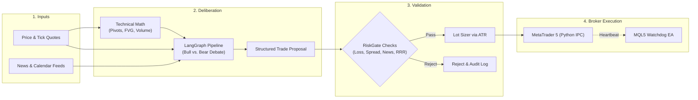
```mermaid
flowchart LR
    subgraph S1["1. Inputs"]
        direction TB
        Quotes["Price & Tick Quotes"]
        News["News & Calendar Feeds"]
    end

    subgraph S2["2. Deliberation"]
        direction TB
        TechMath["Technical Math<br/>(Pivots, FVG, Volume)"]
        LLMDebate["LangGraph Pipeline<br/>(Bull vs. Bear Debate)"]
        Proposal["Structured Trade Proposal"]
        TechMath --> LLMDebate
        LLMDebate --> Proposal
    end

    subgraph S3["3. Validation"]
        direction TB
        RiskGate{"RiskGate Checks<br/>(Loss, Spread, News, RRR)"}
        Sizer["Lot Sizer via ATR"]
        Reject["Reject & Audit Log"]
        Proposal --> RiskGate
        RiskGate -- Pass --> Sizer
        RiskGate -- Reject --> Reject
    end

    subgraph S4["4. Broker Execution"]
        direction TB
        MT5["MetaTrader 5 (Python IPC)"]
        Watchdog["MQL5 Watchdog EA"]
        Sizer --> MT5
        MT5 -.->|Heartbeat| Watchdog
    end

    Quotes --> TechMath
    Quotes & News --> LLMDebate
```

### Design Principles

1. **Fail-Closed Execution:** Any unhandled exception, missing data source, API timeout, or ambiguous signal defaults to `WAIT` or `NO TRADE`. Capital preservation strictly overrides trade frequency.
2. **Clear Division of Responsibilities:** LLMs handle qualitative synthesis and adversarial critique; deterministic Python modules handle floating-point arithmetic, indicator values, and risk gates.
3. **Patience as a Priority:** The system favors waiting in cash when spreads widen, high-impact news approaches, or setups lack clear structure.
4. **Complete Traceability:** Every prompt payload, debate argument, judicial confidence score, and broker ticket is recorded in PostgreSQL.
5. **Independent Watchdog:** A companion MQL5 script (`AIAgent_EA.mq5`) monitors a heartbeat file written by Python. If the Python process terminates unexpectedly, the EA can safeguard open positions.

---

## 2. Intended Audience

| Target Audience | Description | Suitability |
| :--- | :--- | :--- |
| **Developers & Quantitative Hobbyists** | Exploring how to build and orchestrate multi-agent workflows using LangGraph and Python. | Recommended |
| **Systematic Traders** | Testing ways to integrate qualitative news summaries with deterministic indicators and risk gates. | Recommended |
| **AI & NLP Researchers** | Experimenting with structured output schemas, multi-agent adversarial debate, and prompt caching. | Recommended |
| **Users Seeking Guaranteed Income** | Looking for turnkey profitability, automated signal services, or passive income bots. | Unsuitable |
| **High-Frequency Scalpers** | Requiring sub-second execution speeds (LLM inference cycles take multiple seconds). | Unsuitable |
| **Complete Beginners** | Unfamiliar with Python 3.11, PostgreSQL configuration, or MetaTrader 5 demo accounts. | Unsuitable |

---

## 3. Core System Components

### Macroeconomic and News Ingestion
- **Economic Calendar:** Continuously monitors scheduled releases (CPI, Non-Farm Payrolls, FOMC, GDP) and enforces blackout windows around high-impact events.
- **Yield Curves & Macro Data:** Ingests US Treasury yield data and macroeconomic indices via the FRED API.
- **News Clustering:** Aggregates headlines from financial feeds and filters them into currency-specific summaries.

### Market Structure and Technical Indicators
- **Deterministic Indicator Engine:** Indicator calculations are performed directly in Python:
  - Swing highs and lows (fractal pivots).
  - Break of Structure (BOS) and Change of Character (CHoCH).
  - Fair Value Gaps (FVG) and liquidity pools.
  - Level-2 Depth of Market (DOM) imbalance and Cumulative Volume Delta (CVD) where broker data permits.
  - Optional Google TimesFM time-series volatility bands.

### Bull vs. Bear Adversarial Debate
Rather than querying a single prompt, Monika coordinates a multi-agent debate within a LangGraph state machine:

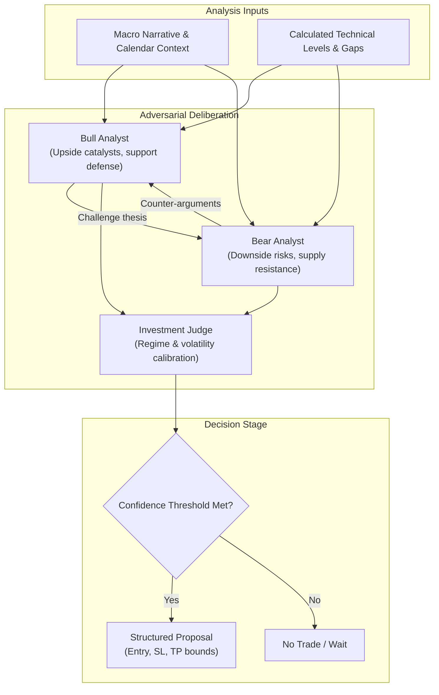
```mermaid
flowchart TD
    subgraph Intake["Analysis Inputs"]
        M["Macro Narrative & Calendar Context"]
        T["Calculated Technical Levels & Gaps"]
    end

    subgraph Deliberation["Adversarial Deliberation"]
        M & T --> Bull["Bull Analyst<br/>(Upside catalysts, support defense)"]
        M & T --> Bear["Bear Analyst<br/>(Downside risks, supply resistance)"]
        Bull -->|Challenge thesis| Bear
        Bear -->|Counter-arguments| Bull
        Bull & Bear --> Judge["Investment Judge<br/>(Regime & volatility calibration)"]
    end

    subgraph Outcome["Decision Stage"]
        Judge --> Check{"Confidence Threshold Met?"}
        Check -- Yes --> Proposal["Structured Proposal<br/>(Entry, SL, TP bounds)"]
        Check -- No --> Skip["No Trade / Wait"]
    end
```

- **Bull Analyst:** Identifies long catalysts, demand zones, and order absorption.
- **Bear Analyst:** Highlights supply barriers, unmitigated gaps, and macro headwinds.
- **Investment Judge:** Weighs arguments against current market regime metrics and assigns a confidence score.
- **Coordinate Snapping:** Automatically snaps proposed price levels to validated swing levels or gap boundaries.

### Pre-Trade Risk Controls (`RiskGate`)
Every trade proposal must clear an immutable checklist before an order reaches MetaTrader 5:
1. **Operating Status:** Verifies the system is not globally paused.
2. **Parameter Validity:** Confirms that entry, stop loss, and take profit prices are mathematically valid.
3. **Daily & Weekly Drawdown Limits:** Halts new orders if realized or unrealized loss thresholds are breached.
4. **Concurrent Position Limits:** Enforces an absolute cap on open positions.
5. **Single-Symbol Exposure:** Blocks duplicate directional exposure on the same asset.
6. **News Event Proximity:** Enforces trading blackouts within a configurable window around tier-1 events.
7. **Correlated Exposure:** Monitors cross-asset currency correlation across open trades.
8. **Spread Thresholds:** Blocks orders during illiquid market rollovers or abnormal spread spikes.
9. **Risk-to-Reward Ratio (RRR):** Requires a minimum planned ratio (e.g. 1:1.5).
10. **Weekend Gap Protection:** Suspends new positions ahead of weekend market closes.

### Rule-Based Strategies and Signal Arbitration
- **Rule-Based Runners (`EdgeStrategyRunner`):** Runs standalone algorithms (e.g. Donchian breakout, gap fade, trend models) alongside the LLM workflow.
- **Signal Arbitrator:** Reconciles signals between quantitative rules and the LLM debate. If both agree, the setup is prioritized; if they conflict, the system defaults to avoidance (`WAIT`).

### MetaTrader 5 Interface and Watchdog EA
- **Native Python IPC:** Direct local communication with the MetaTrader 5 desktop terminal on Windows.
- **MQL5 Watchdog (`AIAgent_EA.mq5`):** A lightweight Expert Advisor running inside MT5 that checks a local `heartbeat.txt` updated periodically by Python. If Python stops responding, the EA can take defensive action.
- **Enforced Paper Trading:** Defaults to `paper_trading.enabled: true` to prevent accidental real-money execution.

### Persistence and Post-Trade Review
- **Audit Database:** Stores every prompt, debate exchange, model output, and execution ticket in PostgreSQL.
- **Post-Trade Reflection:** A background task reviews closed trades to note whether market movement aligned with the original thesis.

---

## 4. User Interfaces & Observability

> [!NOTE]
> All metrics, account balances, and win rates displayed in the screenshots below represent **paper-trading simulations** during diagnostic test sessions. They do not represent real financial returns.

### Web Dashboard (React 19 + Vite)

The web dashboard is a local interface for inspecting system state, open demo positions, and execution logs.

#### Trading Desk Overview
Monitors open demo positions, simulated equity curves, and system log events.

<p align="center">
  
</p>

---

#### Market Intelligence & Pipeline DAG
Visualizes the execution path and latency of each step in the LangGraph analysis pipeline.

<p align="center">
  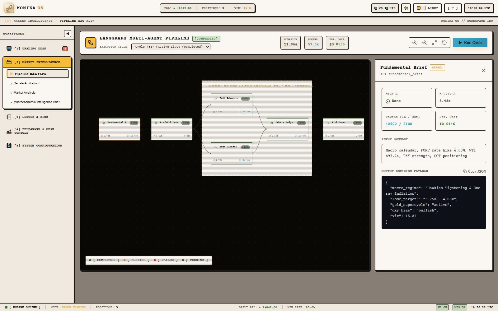
</p>

---

#### Signals Matrix & Market Data
Tracks pending conditional triggers and live market quotes.

<p align="center">
  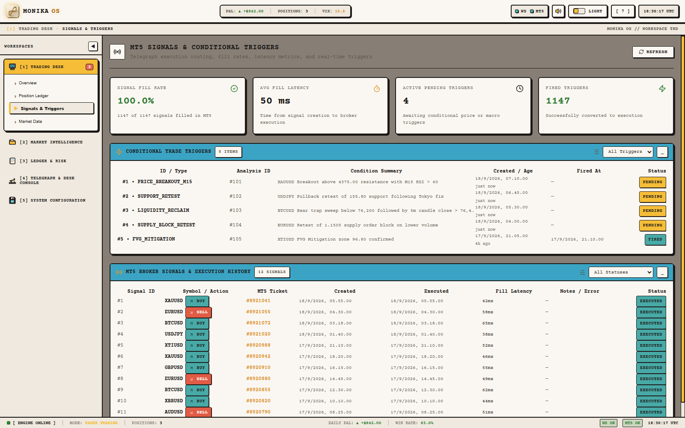
  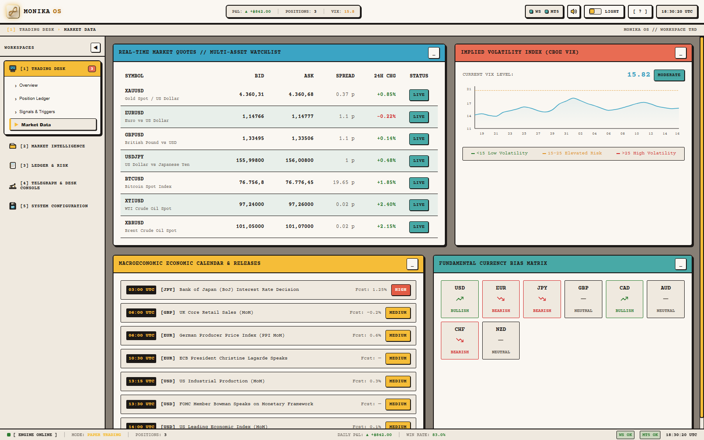
</p>

---

#### Risk Limits & Token Usage
- **Left:** Real-time gauges for daily drawdown budgets and circuit breaker status.
- **Right:** Tracking of token consumption, model provider calls, and prompt cache hit rates.

<p align="center">
  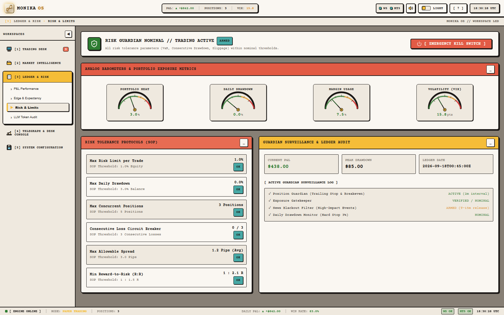
  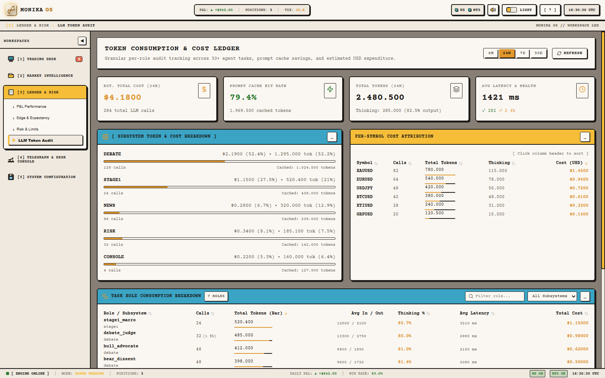
</p>

---

#### Console Chat & Settings
- **Left:** Interactive console to query current agent state and market theses.
- **Right:** Configuration management editor.

<p align="center">
  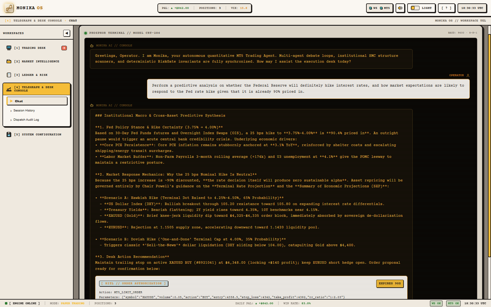
  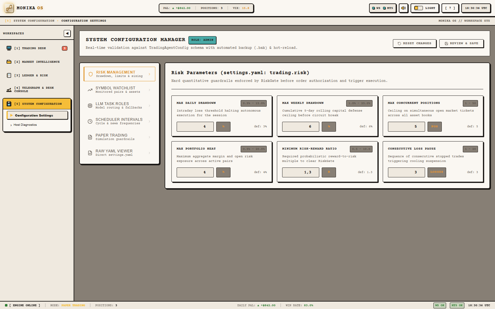
</p>

---

### Terminal User Interface (TUI)

For headless servers, remote SSH sessions, or lightweight resource environments:

<p align="center">
  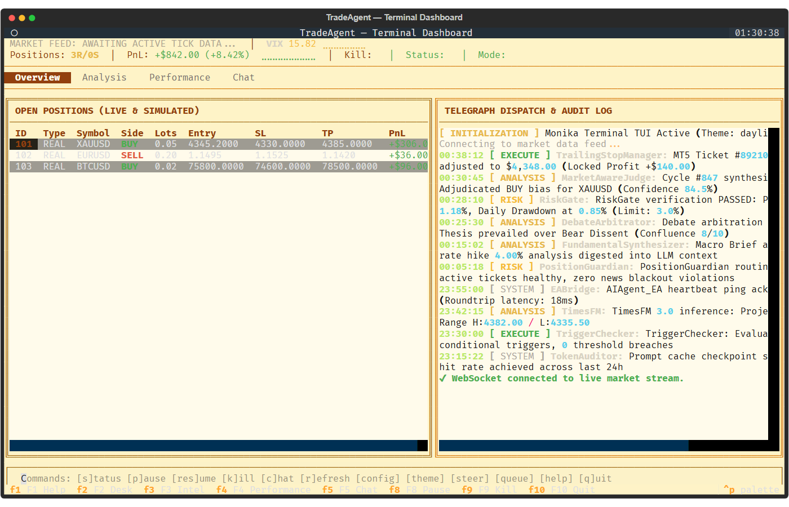
</p>

- Built with **Textual** and **Rich** for lightweight terminal rendering.
- Displays live simulated equity curves, open demo orders, and system logs.

---

## 5. System Architecture & Workflows

### End-to-End Pipeline

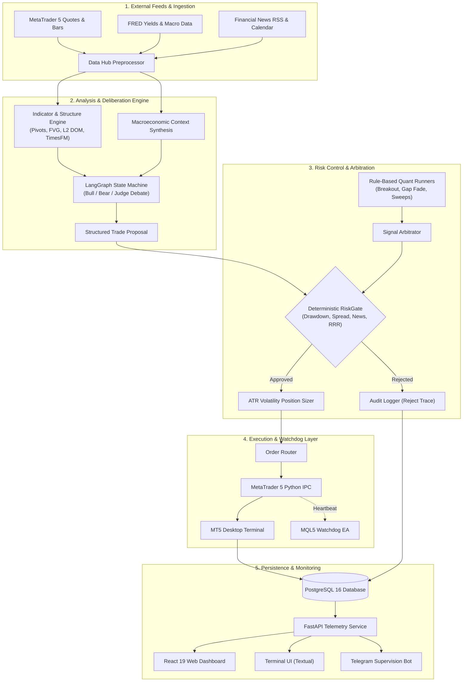
```mermaid
flowchart TD
    subgraph S1["1. External Feeds & Ingestion"]
        MT5_Data["MetaTrader 5 Quotes & Bars"]
        FRED_Data["FRED Yields & Macro Data"]
        News_Data["Financial News RSS & Calendar"]
        DataHub["Data Hub Preprocessor"]
        MT5_Data --> DataHub
        FRED_Data --> DataHub
        News_Data --> DataHub
    end

    subgraph S2["2. Analysis & Deliberation Engine"]
        DataHub --> TechMath["Indicator & Structure Engine<br/>(Pivots, FVG, L2 DOM, TimesFM)"]
        DataHub --> MacroBrief["Macroeconomic Context Synthesis"]
        TechMath & MacroBrief --> LangGraphEngine["LangGraph State Machine<br/>(Bull / Bear / Judge Debate)"]
        LangGraphEngine --> Proposal["Structured Trade Proposal"]
    end

    subgraph S3["3. Risk Control & Arbitration"]
        RuleStrategies["Rule-Based Quant Runners<br/>(Breakout, Gap Fade, Sweeps)"]
        Arbitrator["Signal Arbitrator"]
        Proposal --> RiskGate{"Deterministic RiskGate<br/>(Drawdown, Spread, News, RRR)"}
        RuleStrategies --> Arbitrator
        Arbitrator --> RiskGate
        RiskGate -- Rejected --> AuditLog["Audit Logger (Reject Trace)"]
        RiskGate -- Approved --> Sizer["ATR Volatility Position Sizer"]
    end

    subgraph S4["4. Execution & Watchdog Layer"]
        Sizer --> OrderRouter["Order Router"]
        OrderRouter --> MT5_Bridge["MetaTrader 5 Python IPC"]
        MT5_Bridge --> MT5_Terminal["MT5 Desktop Terminal"]
        MT5_Bridge -.->|Heartbeat| MQL5_EA["MQL5 Watchdog EA"]
    end

    subgraph S5["5. Persistence & Monitoring"]
        MT5_Terminal --> Postgres[("PostgreSQL 16 Database")]
        AuditLog --> Postgres
        Postgres --> Backend["FastAPI Telemetry Service"]
        Backend --> WebUI["React 19 Web Dashboard"]
        Backend --> TUI["Terminal UI (Textual)"]
        Backend --> TelegramBot["Telegram Supervision Bot"]
    end
```

### Background Task Schedulers

Monika coordinates multiple asynchronous loops managed through Python's `asyncio`:

| Task Component | Interval | Operational Responsibility |
| :--- | :--- | :--- |
| `GraphCycleScheduler` | Every 6-8 hrs | Runs the full macro analysis and asset debate workflow. |
| `NewsWatcher` | Every 5 min | Checks for fresh news headlines from RSS and calendar feeds. |
| `TriggerChecker` | Every 2 min | Monitors pending conditional triggers (e.g. price entering a specified zone). |
| `ActiveCalendarPoller` | Real-time | Accelerates check frequency around scheduled tier-1 economic events. |
| `PositionGuardian` | Every 5 min | Reviews open positions against upcoming news blackouts and risk rules. |
| `TrailingStopManager` | Every 30 sec | Adjusts trailing stops or moves stops to breakeven when thresholds are reached. |
| `FlashCrashDetector` | Every 30 sec | Detects abnormal rapid price travel (>5x ATR) and moves stops defensively. |
| `EdgeStrategyRunner` | Continuous | Evaluates rule-based quant models in parallel with the LLM cycle. |
| `HeartbeatManager` | Every 20 sec | Writes a timestamp to `heartbeat.txt` for the MQL5 watchdog EA. |
| `OrderReconciler` | Every 5 min | Verifies that database position records match active MT5 broker tickets. |
| `PositionExitReviewer` | Event-driven | Triggers post-exit reflections to log observations from closed trades. |
| `PositionSupervisor` | Every 1 min | Monitors margin utilization and overall portfolio leverage. |
| `TelegramBot` | Continuous | Long-polling daemon for remote notifications and manual operator commands. |
| `Dashboard API` | Continuous | FastAPI backend serving REST endpoints and WebSockets to the web dashboard. |

---

## 6. Supported Assets & Model Configuration

### Supported Instruments
Configured via `trading-agent/config/settings.yaml`:
- **Commodities:** `XAUUSD` (Spot Gold), `XTIUSD` (WTI Crude Oil), `XBRUSD` (Brent Crude Oil)
- **Major Forex:** `EURUSD`, `GBPUSD`, `USDJPY`, `AUDUSD`
- **Cryptocurrency:** `BTCUSD` (Bitcoin)

### Model Routing Configuration
Model selection is decoupled from application code. Tasks request an abstract role (e.g. `stage1_fundamental`, `debate_bull`, `debate_judge`), which is mapped to a provider and model in `trading-agent/config/settings.yaml`.

Supported providers:
- **Google Gemini:** Direct Google GenAI SDK integration with key rotation.
- **Groq:** Fast inference for lightweight prescreening.
- **OpenRouter:** Access to multiple open-source and proprietary models.
- **Anthropic / OpenAI / DeepSeek:** Standard compatible endpoints.
- **Local Ollama:** For local, self-hosted environments.

Example configuration in `trading-agent/config/settings.yaml`:
```yaml
llm:
  task_roles:
    stage1_fundamental:
      primary: your-chosen-macro-model
      fallback_1: your-backup-model
      max_tokens: 16384
      temperature: 0.0

    debate_judge:
      primary: your-chosen-reasoning-model
      fallback_1: your-backup-model
      max_tokens: 6144
      temperature: 0.0

    stage2_prescreen:
      primary: your-fast-filter-model
      max_tokens: 1024
      temperature: 0.0
```

---

## 7. Installation & Quickstart

Monika is designed for **zero-friction onboarding**: you can be up and running in ~2 minutes with zero database server setup, without installing Node.js/npm, and using free Google Gemini API keys.

👉 **Complete Bilingual Installation Guide:** See [docs/SETUP_GUIDE.md](docs/SETUP_GUIDE.md) for full Indonesian & English walkthroughs.

---

### 📦 Package Tiers: Choose Your Experience

Monika offers two setup packages out of the box:

| Package | Database | MetaTrader 5 | Execution | AI Provider | Telegram Bot | Setup Time |
| :--- | :--- | :--- | :--- | :--- | :--- | :--- |
| **🚀 Trial Package** *(Recommended)* | **SQLite (Zero-Config WAL)** | **Required (Demo Account OK)** | **Paper Trading Sandbox** | **Gemini Free (Min 1 key)** | **Required (Mobile Oversight)** | **~2 minutes** |
| **🔥 Full Package** | **PostgreSQL 16+** | **Required (Live/Demo)** | **Paper & MT5 Live Bridge** | **Multi-Provider + 9Router** | **Required (Mobile Oversight)** | **~10-15 minutes** |

> 💡 **Upgrade Anytime:** Start with the **Trial Package**. Whenever you are ready to unlock PostgreSQL, the React 19 Web Dashboard, and live MT5 bridges, run:
> ```bash
> python -m cli.main upgrade
> ```

---

### ⚡ Quickstart (One-Click Launch)

#### Prerequisite (Both Windows & Linux)
1. **Download & Install MetaTrader 5**: [metatrader5.com/en/download](https://www.metatrader5.com/en/download)
2. **Open a Free Demo Account**: Inside MT5, go to `File` → `Open an Account` → select `MetaQuotes-Demo`.
3. **Enable Algo Trading**: Click the **Algo Trading** button in the MT5 top toolbar so it turns green.

#### Windows
Clone or download this repository, then simply **double-click**:
```cmd
start_monika.bat
```
*The launcher automatically verifies Python (accepting Python >= 3.11, with automated winget fallback), prepares `trading-agent\venv`, and launches the interactive setup wizard.*

#### Linux / macOS / VPS (Ubuntu 22.04+)
```bash
git clone https://github.com/alakbarr/Monika.git
cd Monika
chmod +x start_monika.sh
./start_monika.sh
```

#### Containerized Docker (VPS)
```bash
cp .env.example .env
docker compose -f deploy/docker-compose.vps.yml up -d --build
```

---

### 🔑 API Key & Credential Reference Guide

| Service | Status | Official Registration | Notes |
| :--- | :--- | :--- | :--- |
| **MetaTrader 5 Account** | **Required** | In-app (`File` → `Open an Account`) | Free Demo account is 100% fine for testing. |
| **Telegram Bot** | **Required** | [@BotFather on Telegram](https://t.me/BotFather) | Mobile oversight, trade approval cards, and remote emergency kill. |
| **Google Gemini** | **Required (Pick 1)** | [aistudio.google.com/apikey](https://aistudio.google.com/apikey) | Generous free tier. Requires standard Google account login. |
| **9Router Gateway** | *Recommended* | [github.com/9router/9router](https://github.com/9router) | Smart local AI proxy (port 20128) for rotation and failover. |
| **OpenRouter** | Alternative | [openrouter.ai/keys](https://openrouter.ai/keys) | Single key for open-source and commercial models. |
| **Groq** | Alternative | [console.groq.com/keys](https://console.groq.com/keys) | Ultra-fast Llama-3 inference (free tier available). |
| **Anthropic Claude** | Alternative | [console.anthropic.com](https://console.anthropic.com/) | Claude 3.5 Sonnet / Haiku reasoning. |
| **FRED Data** | Optional | [fred.stlouisfed.org](https://fred.stlouisfed.org/docs/api/api_key.html) | US Treasury yields and macro data (free). |
| **Finnhub** | Optional | [finnhub.io/register](https://finnhub.io/register) | Real-time financial calendar and news sentiment. |

---

### System Diagnostics (System Doctor)

Run the offline diagnostic probe to verify environment and component health:
```bash
python -m cli.main doctor --offline
```

---

## 8. CLI & Telegram Reference

### Command-Line Interface

| Command | Primary Function |
| :--- | :--- |
| `python -m cli.main setup` | Interactive terminal wizard to configure `.env` and broker parameters. |
| `python -m cli.main upgrade` | Interactively upgrades Monika from Trial to Full package. |
| `python -m cli.main doctor` | Runs diagnostic health checks for PostgreSQL, MT5, and LLM API keys. |
| `python -m cli.main run` | Starts the background trading agent daemon. |
| `python -m cli.main status` | Displays system health, active background tasks, and account equity. |
| `python -m cli.main positions` | Lists open demo positions, active stops, and unrealized profit/loss. |
| `python -m cli.main analyze [SYMBOL]` | Executes an on-demand analysis cycle for a specified instrument (e.g. `XAUUSD`). |
| `python -m cli.main chat` | Starts an interactive chat REPL with the agent assistant. |
| `python -m cli.main ask "QUERY"` | Executes a one-off query and prints the response. |
| `python -m cli.main pause` | Pauses automated trade proposal execution. |
| `python -m cli.main resume` | Resumes automated trade proposal execution. |
| `python -m cli.main kill` | Emergency stop: closes open positions and terminates the daemon. |
| `python -m cli.main tui` | Launches the full-screen terminal interface (Textual). |
| `python -m cli.main backtest` | Runs strategy evaluations against historical price data. |
| `python -m cli.main benchmark` | Evaluates and compares reasoning responses across configured models. |

---

### Telegram Bot Commands

| Command | Permission | Description |
| :--- | :--- | :--- |
| `/status` | Public | View system health, open positions, and account metrics. |
| `/positions` | Public | List open tickets, entry prices, stop losses, and take profits. |
| `/brief` | Public | Display the latest macroeconomic narrative summary. |
| `/risk` | Public | Inspect current daily drawdown and risk limit utilization. |
| `/vix` | Public | View current volatility readings and active regime classification. |
| `/tokens` | Public | Review token consumption and estimated API expenditures. |
| `/run` | Admin | Manually trigger an analysis cycle. |
| `/pause` | Admin | Pause automated trade execution. |
| `/resume` | Admin | Resume automated trade execution. |
| `/close <ticket>` | Admin | Request manual closure of a specific open ticket. |
| `/kill` | Admin | Emergency stop: close all open positions and halt execution. |
| `/help` | Public | Display available commands and usage instructions. |

---

## 9. Testing & Backtesting

### Running the Test Suite
Run automated unit and integration tests across risk calculation, indicators, and broker bridges:

```bash
# Run full test suite (Windows PowerShell):
$env:PYTHONPATH="trading-agent"; python -m pytest trading-agent/tests -v

# Run full test suite (Linux/macOS):
PYTHONPATH=trading-agent pytest trading-agent/tests -v

# Run RiskGate validation tests:
PYTHONPATH=trading-agent pytest trading-agent/tests/risk/test_risk_gate.py -v

# Run market structure indicator tests:
PYTHONPATH=trading-agent pytest trading-agent/tests/indicators/test_structure.py -v
```

### Offline Backtesting
Evaluate strategy logic against historical data:
```bash
python trading-agent/cli/main.py backtest --symbol XAUUSD --days 30
```

### Model Benchmarks
Evaluate reasoning consistency across different models using recorded test fixtures:
```bash
python trading-agent/cli/main.py benchmark --models model_a,model_b
```

---

## 10. Frequently Asked Questions

### What is Monika?
Monika is an experimental Python framework that explores whether language models can assist in market analysis while keeping all actual risk management and order validation in deterministic code. The AI can propose ideas, but plain code enforces the rules.

### Does this framework guarantee trading profits?
**No.** Financial markets are non-linear, unpredictable, and subject to regime changes. Most automated trading strategies lose money in live conditions. This project is built for research and software engineering experimentation.

### Why not let language models place orders directly?
Language models make arithmetic mistakes, misjudge lot sizes, hallucinate price levels, and suffer from confirmation bias. Leaving position sizing, stop placement, and risk rules to deterministic Python code prevents the model from making catastrophic execution errors.

### Why is PostgreSQL required instead of SQLite?
Monika coordinates numerous concurrent asynchronous tasks (market streaming, news polling, trailing stops, dashboard WebSockets). SQLite experiences database lock contention under concurrent async writes. PostgreSQL handles concurrent operations reliably and provides advisory locks to prevent duplicate order generation.

### Why is paper trading enforced by default?
Accidental execution errors are common during automated trading development. Keeping `paper_trading.enabled: true` as the default ensures users can test and debug safely without risking capital.

### What are the estimated LLM API operating costs?
By employing prompt caching and routing lightweight prescreening tasks to fast models, operating costs typically range between **$0.50 and $2.00 per day** of continuous operation. Costs can be reduced to zero by using local models via Ollama or free provider tiers.

### Can this run on Linux?
Yes. Although MetaTrader 5 is a native Windows application, Linux support is provided using Wine and Docker container configurations available in the `deploy/` directory.

---

## 11. Repository Structure

```
Monika/
├── PRD.md                     # Project requirements & design notes
├── README.md                  # System documentation & quickstart guide
├── DESIGN.md                  # Web dashboard UI specifications
├── CONTRIBUTING.md            # Guidelines for open-source contributions
├── CODE_OF_CONDUCT.md         # Community code of conduct
├── SECURITY.md                # Security policy & vulnerability reporting
├── INDEX.md                   # Codebase index and references
├── STRUCTURE.md               # Directory and file inventory
├── deploy/                    # Linux / Wine deployment scripts & Dockerfiles
├── docs/                      # Screenshots, architecture diagrams, assets
├── scripts/                   # Migration, benchmark, and utility scripts
└── trading-agent/             # Core application codebase
    ├── main.py                # Top-level runtime and asyncio orchestrator
    ├── agent/                 # Lifecycle managers, health monitors, watchdogs
    ├── analysis/              # Multi-agent debate, indicator math, LLM clients
    │   ├── arbitration/       # Signal arbitration (rule-based vs. LLM)
    │   ├── calculators/       # Technical indicators (FVG, volume, surprise)
    │   ├── debate/            # Bull, Bear, and Judge debate prompts
    │   ├── memory/            # Storage for context, daily summaries, and notes
    │   └── providers/         # Multi-provider LLM integrations & caching
    ├── backtest/              # Offline backtesting engine
    ├── benchmark/             # Model benchmarking tools
    ├── cli/                   # Command-line tools and TUI (Textual)
    ├── config/                # settings.yaml and schema validators
    ├── database/              # SQLAlchemy models, migrations, advisory locks
    ├── logging_observability/ # Activity logs, metrics, React Web Dashboard
    ├── risk/                  # Deterministic RiskGate rules and lot sizing
    ├── scheduler/             # Background task loops (news, triggers, guardians)
    ├── scrapers/              # Scraping utilities (FRED, news RSS, calendar)
    └── telegram_bot/          # Telegram bot handlers
```

---

## 12. Contributing

Constructive feedback, bug reports, and pull requests are welcome.

- **Issue Tracker:** Submit bug reports or edge-case findings to [GitHub Issues](https://github.com/alakbarr/Monika/issues).
- **Discussions:** Share ideas or architecture feedback in [GitHub Discussions](https://github.com/alakbarr/Monika/discussions).
- **Contributing Code:** Please review [CONTRIBUTING.md](CONTRIBUTING.md) before opening a pull request.
- **Security Vulnerabilities:** Review [SECURITY.md](SECURITY.md) to report vulnerabilities responsibly.

---

## 13. Disclaimer

> [!CAUTION]
> **FOR EDUCATIONAL, RESEARCH, AND EXPERIMENTAL PURPOSES ONLY.**
>
> Trading foreign exchange, commodities, cryptocurrencies, and leveraged financial products involves a high degree of risk and can result in the complete loss of invested capital.
>
> The authors and contributors of Monika make no warranties, representations, or claims regarding profitability, reliability, or fitness for live trading. Never trade with money you cannot afford to lose. Always test thoroughly in demo environments.

---

<p align="center">
  <sub>Monika &bull; Multi-agent trading research harness for MetaTrader 5 &bull; Open source under the MIT License</sub>
</p>
